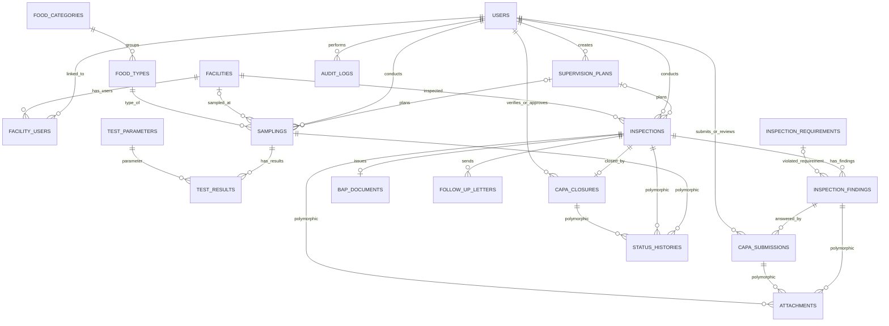
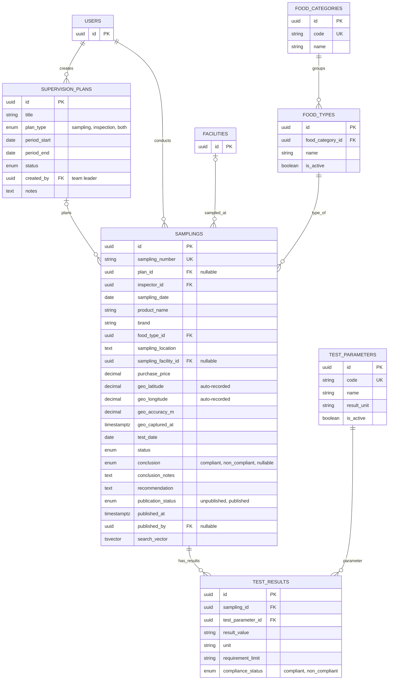
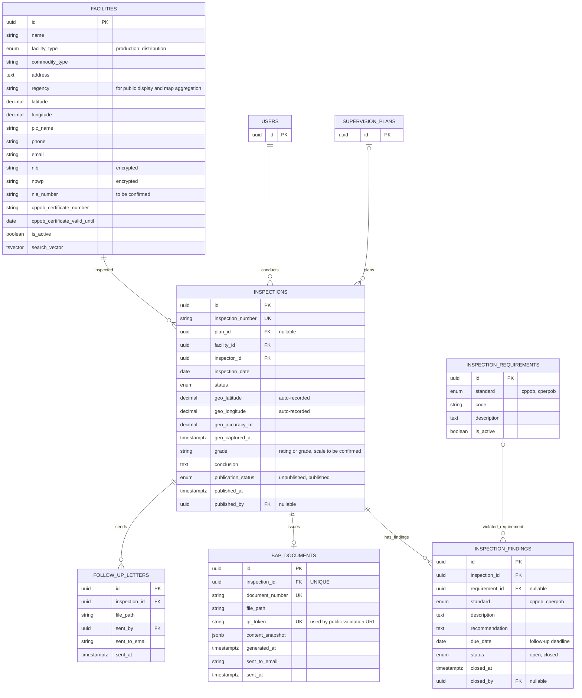
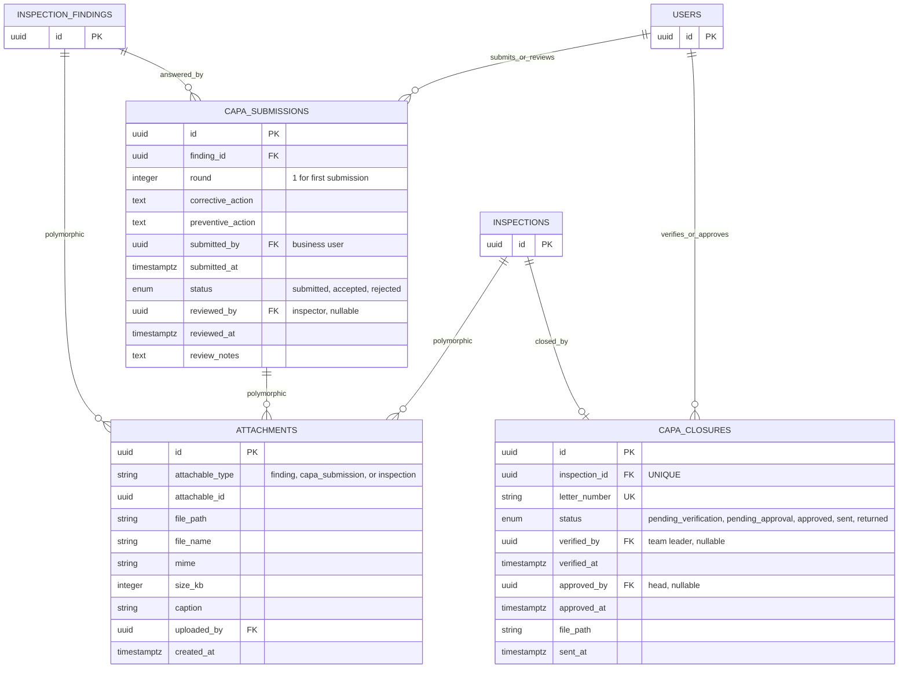
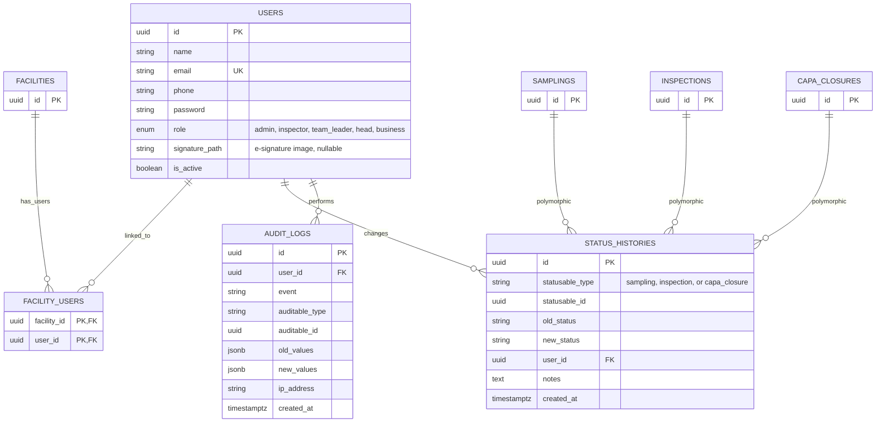

# Product Requirements Document (PRD)
## Sistem Informasi Kawal Hasil Pengawasan (Si Kahayan)

| | |
|--|--|
| **Nama Sistem** | Si Kahayan — Sistem Informasi Kawal Hasil Pengawasan |
| **Tanggal** | 24 September 2026 |
| **Penyusun** | Umar Saifudin — PFM Ahli Muda |
| **Instansi** | Balai Besar POM di Palangka Raya |

---

## Ringkasan Sistem

Balai Besar POM di Palangka Raya membutuhkan sistem digital terpadu untuk mengelola **hasil pengawasan pangan olahan pasca-edar: sampling dan pengujian produk, inspeksi sarana produksi dan distribusi, serta tindak lanjut temuan (CAPA)**. Sistem ini memudahkan inspektur mencatat hasil di lapangan secara real-time dengan geotagging, memudahkan pelaku usaha mengirim dan memantau tindak lanjut perbaikan, memungkinkan masyarakat melihat hasil pengawasan secara umum, dan memberikan pimpinan dashboard serta laporan yang terintegrasi. Target: seluruh temuan tercatat dan dapat ditelusuri dari pemeriksaan sampai Closed CAPA dalam satu sistem. *(Target waktu proses dalam angka — lihat Lampiran B.)*

---

## Arsitektur & Teknologi

### Stack Teknologi

| Komponen | Teknologi | Versi | Keterangan |
|----------|-----------|-------|------------|
| **Bahasa** | PHP | ≥ 8.3 | Versi minimum yang didukung Laravel 13 |
| **Framework** | [Laravel](https://laravel.com/) | v13 | Full-stack PHP framework |
| **Admin Panel** | [Filament](https://filamentphp.com/) | v5 | UI framework berbasis TALL Stack (Tailwind CSS, Alpine.js, Livewire, Laravel) |
| **Database** | PostgreSQL | ≥ 16 | RDBMS utama untuk seluruh data aplikasi |
| **Frontend** | TALL Stack | — | Tailwind CSS + Alpine.js + Livewire (bawaan Filament) |

### Arsitektur Database — PostgreSQL

| Fitur PostgreSQL | Kegunaan dalam Si Kahayan |
|------------------|---------------------------|
| **UUID** (`uuid` / `ulid`) | Primary key entitas yang diekspos publik (sampling, inspeksi, dokumen BAP, surat Closed CAPA). Nomor yang mudah dibaca (`sampling_number`, `inspection_number`, `document_number`, `letter_number`) disimpan di kolom unik terpisah |
| **JSONB** | Salinan isi BAP saat diterbitkan (`content_snapshot`) agar dokumen dapat divalidasi ulang, serta nilai lama/baru pada audit log |
| **Full-Text Search** (`tsvector`) | Pencarian publik atas nama produk dan nama sarana (`search_vector`) |
| **Enum Types** | Status sampling, inspeksi, temuan, CAPA, dan status publikasi (lihat Lampiran A.2) |
| **Partial Index** | Contoh: temuan yang masih terbuka (`WHERE status = 'open'`), data yang sudah dipublikasikan (`WHERE publication_status = 'published'`) |
| **Foreign Key Constraints** | Integritas antar tabel, termasuk satu BAP dan satu surat Closed CAPA per inspeksi |
| **Timestamp with Time Zone** | Seluruh waktu (termasuk waktu geotagging) disimpan `timestamptz`, ditampilkan `Asia/Jakarta`. Koordinat disimpan sebagai `decimal` latitude/longitude |

### Struktur Panel Filament v5

| Panel | Path | Peran Pengguna | Deskripsi |
|-------|------|----------------|-----------|
| **Admin** | `/admin` | Administrator, Petugas Layanan (Inspektur Pangan), Ketua Tim | Perencanaan, input hasil sampling dan uji, inspeksi, evaluasi CAPA, data master, dan pengguna |
| **Pimpinan** | `/pimpinan` | Kepala Balai, Ketua Tim | Dashboard, laporan, dan analisis. Kepala Balai juga mengesahkan Closed CAPA secara digital |
| **Portal Pelaku Usaha** | `/portal` | Pelaku Usaha | Melihat temuan dan rekomendasi, membuat dan mengirim CAPA, cek status penilaian, dan menerima BAP serta surat Closed CAPA |
| **Halaman Publik** | `/` (di luar panel) | Masyarakat, tanpa login | Dashboard umum hasil pengawasan, pencarian produk dan sarana, dan validasi BAP lewat QR Code (`/verify/{token}`) |

### Komponen Filament v5 yang Digunakan

| Komponen | Fungsi |
|----------|--------|
| **Resources** | CRUD: Perencanaan, Sampling, Inspeksi, Sarana, data master (kategori dan jenis pangan, parameter uji, persyaratan CPPOB/CPerPOB), Pengguna |
| **Relation Managers** | Hasil per parameter dalam Sampling, Temuan dalam Inspeksi, CAPA dalam Temuan, Lampiran dan Riwayat Status di setiap entitas |
| **Dashboard Widgets** | Stat widgets, chart widgets, dan widget peta untuk Bagian 3 |
| **Actions & Modals** | Mulai pemeriksaan (rekam geotag), terbitkan BAP, kirim surat tindak lanjut, tetapkan Closed/Opened, verifikasi, sahkan, dan publikasikan |
| **Notifications** | Notifikasi in-app dan email untuk BAP terbit, CAPA masuk, hasil evaluasi, dan Closed CAPA |
| **Tables** | Filter periode, kategori pangan, jenis sarana, status, kabupaten/kota; pencarian; ekspor |
| **Forms** | Form input lapangan, upload foto bukti dan surat, validasi kelengkapan |
| **Infolists** | Detail sampling, inspeksi, dan temuan read-only |
| **Custom Pages** | Peta hasil pengawasan, halaman validasi BAP, halaman laporan dan ekspor |

---

## 1. Pengguna Sistem

| Peran | Siapa | Yang Mereka Lakukan | Panel Filament |
|-------|-------|---------------------|----------------|
| **Administrator** | Staf TI | Mengatur seluruh data dan hak akses pengguna | Admin |
| **Petugas Layanan** | Inspektur Pangan | Input hasil sampling (nama produk, jenis pangan, jumlah, tempat) dan hasil uji, input hasil inspeksi (sarana dan temuan), mengevaluasi CAPA dari pelaku usaha, menetapkan status temuan | Admin |
| **Ketua Tim** | Ketua Tim Inspeksi/Sampling | Menyusun perencanaan sampling dan inspeksi, memverifikasi Closed CAPA, memantau dashboard | Admin, Pimpinan |
| **Kepala Balai** | Kepala Balai | Melihat dashboard dan laporan untuk analisis risiko dan keputusan, mengesahkan Closed CAPA secara digital | Pimpinan |
| **Pelaku Usaha** | Pemilik/penanggung jawab sarana | Login, melihat temuan dan rekomendasi, membuat dan mengirim CAPA, cek status penilaian, menerima BAP dan surat Closed CAPA | Portal Pelaku Usaha |
| **Masyarakat** | Umum | Melihat hasil sampling, pengujian, dan pemeriksaan sarana secara umum, tanpa login | Halaman Publik |

*Catatan review: PRD awal menggabungkan Ketua Tim dan Kepala Balai sebagai "Pimpinan" yang hanya mengevaluasi, padahal alur layanan memberi mereka tindakan (menyusun perencanaan, memverifikasi, mengesahkan). Karena itu dipisah dan panel Pimpinan tidak sepenuhnya read-only (lihat Lampiran B).*

---

## 2. Layanan yang Dikelola Sistem

### Layanan A — Informasi Hasil Sampling dan Pemeriksaan

**Deskripsi:** Petugas mencatat hasil sampling, pengujian, dan pemeriksaan sarana, lalu sistem menampilkan ringkasan umumnya kepada pelaku usaha dan masyarakat secara real-time, tanpa membuka data privat dan rahasia.

**Alur:**
1. Ketua Tim menyusun perencanaan sampling dan pemeriksaan sarana
2. Petugas melakukan sampling dan menginput hasilnya (tanggal, nama produk, jenis pangan, tempat sampling)
3. Petugas menginput hasil pengujian (tanggal uji, hasil per parameter uji, kesimpulan MS/TMS beserta keterangan)
4. Petugas menginput hasil inspeksi/pemeriksaan sarana (tanggal, nama sarana, lokasi, rating/grade, kesimpulan)
5. Ketua Tim mempublikasikan hasil yang layak tampil *(usulan, lihat Lampiran B)*
6. Masyarakat dan pelaku usaha melihat jenis produk yang telah disampling dan diuji serta sarana yang telah diperiksa

**Data yang dicatat:** tanggal sampling · nama produk · kategori dan jenis pangan · tempat sampling · harga produk · tanggal uji · hasil per parameter uji · kesimpulan akhir (MS/TMS) beserta keterangan · rekomendasi · nama sarana/perusahaan · alamat dan koordinat GPS sarana · tanggal pemeriksaan · rating/grade dan kesimpulan penilaian

**Aturan bisnis:**
- **Data privat dan rahasia dikecualikan** dari informasi publik. Sistem menampilkan ke publik hanya kolom yang masuk daftar putih (whitelist) di lapisan tampilan publik, bukan dengan menyaring di sisi tampilan. Usulan awal ada di Lampiran B
- Hasil hanya tampil ke publik jika `publication_status = published` *(usulan)*
- Dashboard **dinamis dan terintegrasi**: angka, grafik, dan peta diperbarui otomatis mengikuti perubahan data pengawasan
- Kesimpulan `non_compliant` (TMS) wajib disertai keterangan dan rekomendasi *(usulan)*
- Setiap perubahan status tercatat dalam riwayat (waktu, pengguna, catatan)
- Halaman publik dapat diakses **tanpa login**

---

### Layanan B — Monitoring Hasil Pengawasan

**Deskripsi:** Petugas melakukan sampling dan pemeriksaan sarana di lapangan dengan geotagging otomatis, sistem menerbitkan BAP, lalu tindak lanjut temuan dikawal lewat CAPA sampai Closed CAPA disahkan dan dikirim ke pelaku usaha.

**Alur:**
1. Ketua Tim menyusun perencanaan pemeriksaan sarana
2. Petugas membuka aplikasi di lokasi; sistem merekam koordinat lokasi (geotagging) secara otomatis
3. Petugas menginput hasil pemeriksaan (tanggal, nama petugas, nama sarana, temuan ketidaksesuaian, rekomendasi, batas waktu tindak lanjut) dan mengunggah foto bukti
4. Sistem otomatis menerbitkan **BAP** resmi (PDF) dengan **QR Code validasi**, lalu mengirimkannya ke akun aplikasi dan email pelaku usaha
5. Jika ada temuan yang harus dilengkapi CAPA, petugas mengunggah dan mengirim surat tindak lanjut ke pelaku usaha
6. Pelaku usaha melihat temuan dan rekomendasi, membuat CAPA (tindakan perbaikan dan pencegahan) beserta data dukung, lalu mengirimnya
7. Petugas mereview CAPA dan menetapkan status temuan **Closed** atau **Opened**
8. Jika Closed, CAPA diteruskan ke Ketua Tim untuk diverifikasi
9. Kepala Balai mengesahkan Closed CAPA secara digital, lalu sistem mengirim surat Closed CAPA ke pelaku usaha

**Data yang dicatat:** nama sarana/perusahaan · jenis sarana (produksi/distribusi) · jenis komoditas · nama penanggung jawab · nomor telepon · email · NIB · NPWP · NIE · nomor dan masa berlaku sertifikat IP CPPOB · alamat lengkap dan koordinat GPS sarana · tanggal pemeriksaan · nama petugas · koordinat geotagging saat pemeriksaan · catatan temuan ketidaksesuaian (terhadap CPPOB/CPerPOB) · rekomendasi perbaikan · batas waktu tindak lanjut · foto bukti dukung · CAPA dan data dukung · file tanda tangan digital (e-signature)

**Aturan bisnis:**
- **Geotagging otomatis**: koordinat, akurasi, dan waktu direkam saat pemeriksaan dimulai dan **tidak dapat diubah** petugas. Pemeriksaan tidak dapat dimulai tanpa izin lokasi perangkat *(usulan)*
- BAP diterbitkan otomatis setelah hasil pemeriksaan disimpan; setiap BAP punya **nomor unik** dan **QR Code** yang membuka halaman validasi publik
- Isi BAP disimpan sebagai salinan (`content_snapshot`) sehingga dokumen yang sudah terbit tidak berubah *(usulan)*
- Surat tindak lanjut hanya dikirim untuk inspeksi yang memiliki temuan
- Pelaku usaha **hanya dapat melihat dan mengirim CAPA untuk sarananya sendiri**
- Setiap temuan berstatus `open` sampai petugas menetapkan `closed`; CAPA yang ditolak membuka kembali kesempatan mengirim CAPA berikutnya (ronde baru) *(usulan)*
- Petugas menetapkan `closed` hanya setelah mengevaluasi bukti dan data dukung CAPA
- Alur pengesahan **berurutan**: verifikasi Ketua Tim, lalu pengesahan digital Kepala Balai, baru surat Closed CAPA dikirim; tahap tidak dapat dilewati
- Surat Closed CAPA hanya dapat diterbitkan jika **seluruh temuan** pada inspeksi tersebut `closed` *(usulan)*
- Temuan yang melewati batas waktu tindak lanjut ditandai **terlambat** pada dashboard *(usulan)*
- **Data privat dan rahasia dikecualikan** dari informasi publik (NIB, NPWP, kontak, tanda tangan, dan dokumen CAPA tidak pernah tampil ke publik)
- Dashboard bersifat dinamis dan terintegrasi secara real-time
- Setiap perubahan status tercatat dalam riwayat

---

## 3. Laporan & Dashboard yang Dibutuhkan

### Dashboard Utama (tampil saat login)

| Informasi | Keterangan |
|-----------|------------|
| Sampel per bulan | Jumlah dan nama sampel produk pangan yang disampling dan diuji per bulan |
| Status uji dan hasil | Status uji, kategori pangan, harga produk, tempat sampling, hasil per parameter uji, kesimpulan akhir, rekomendasi |
| Sarana diperiksa per bulan | Jumlah dan nama sarana (produksi dan distribusi pangan olahan) yang diperiksa per bulan, beserta lokasinya |
| Temuan ketidaksesuaian | Jenis temuan terhadap persyaratan CPPOB dan CPerPOB, kesimpulan hasil penilaian inspeksi |
| Status tindak lanjut | Status penyelesaian tindak lanjut (CAPA) oleh pelaku usaha, termasuk yang terlambat |
| Visualisasi dan peta | Grafik, gambar, dan peta sebaran hasil pemeriksaan dan pengawasan pangan olahan di wilayah kerja BBPOM di Palangka Raya |

Dashboard publik menampilkan versi umum dari informasi di atas, sebatas data yang masuk daftar putih publik.

### Laporan Berkala

| Laporan | Frekuensi | Isi | Format |
|---------|-----------|-----|--------|
| Rekapitulasi hasil pemeriksaan/pendampingan | Bulanan | Rekap sampling, pengujian, dan inspeksi sarana beserta status tindak lanjut, untuk pelaporan instansi | Excel & PDF |
| Rekapitulasi hasil pemeriksaan/pendampingan | Triwulanan | Isi sama dengan bulanan, dalam agregat triwulan | Excel & PDF |

---

## Lampiran A — Rancangan Data (ER Diagram)

Seluruh nama tabel, kolom, relasi, dan nilai enum pada diagram memakai bahasa Inggris (konvensi Laravel: nama tabel jamak, `snake_case`). Singkatan resmi (CPPOB, CPerPOB, CAPA, BAP, NIB, NPWP, NIE) dipertahankan.

### A.1 Gambaran Umum Relasi

Diagram menampilkan seluruh entitas dan relasinya tanpa kolom. Detail kolom ada di A.3 sampai A.6. Relasi `attachments` dan `status_histories` bersifat polimorfik.

### A.2 Nilai Status (Enum) — Usulan

| Entitas | Nilai (berurutan) |
|---------|-------------------|
| **`supervision_plans.status`** | `draft` → `active` → `completed`; cabang: `cancelled` |
| **`samplings.status`** | `planned` → `sampled` → `in_testing` → `completed`; cabang: `cancelled` |
| **`samplings.conclusion`** | `compliant` (MS), `non_compliant` (TMS), kosong selama belum selesai |
| **`inspections.status`** | `planned` → `in_progress` → `bap_issued` → `awaiting_capa` → `capa_review` → `awaiting_signature` → `completed`; cabang: `cancelled`. Inspeksi tanpa temuan langsung `completed` setelah `bap_issued` |
| **`inspection_findings.status`** | `open` ↔ `closed` |
| **`capa_submissions.status`** | `submitted` → `accepted` atau `rejected` (ditolak → pelaku usaha mengirim ronde berikutnya) |
| **`capa_closures.status`** | `pending_verification` → `pending_approval` → `approved` → `sent`; cabang: `returned` |
| **`publication_status`** (sampling dan inspeksi) | `unpublished` → `published` |
| **`facilities.facility_type`** | `production`, `distribution` |
| **`inspection_findings.standard`** | `cppob`, `cperpob` |
| **`users.role`** | `admin`, `inspector`, `team_leader`, `head`, `business` |

### A.3 Perencanaan, Sampling, dan Hasil Uji

### A.4 Sarana, Inspeksi, Temuan, dan BAP

### A.5 CAPA dan Closed CAPA

### A.6 Pengguna, Akses Sarana, Riwayat Status, dan Audit

---

## Lampiran B — Asumsi & Poin yang Perlu Dikonfirmasi

| # | Poin | Usulan sementara |
|---|------|------------------|
| 1 | Target waktu proses (kondisi saat ini dan yang diinginkan) tidak ada di PRD awal | Diisi BBPOM |
| 2 | Ketua Tim dan Kepala Balai digabung sebagai "Pimpinan (hanya evaluasi)", padahal punya tindakan tulis | Dipisah: Ketua Tim di panel Admin dan Pimpinan, Kepala Balai di panel Pimpinan dengan satu aksi pengesahan |
| 3 | Tabel peran menyebut Petugas membuat perencanaan, alur menyebut Ketua Tim | Perencanaan oleh Ketua Tim; petugas hanya menjalankan |
| 4 | Definisi data "privat dan confidential" yang dikecualikan dari publik | Whitelist publik: nama produk, kategori dan jenis pangan, tempat sampling, tanggal, hasil per parameter, kesimpulan MS/TMS, nama sarana, kabupaten/kota, grade, dan status. Tidak tampil: NIB, NPWP, NIE, kontak, penanggung jawab, alamat lengkap, foto, CAPA, tanda tangan |
| 5 | Ketelitian koordinat pada peta publik | Peta publik hanya tingkat kabupaten/kota; koordinat penuh hanya untuk pengguna login internal |
| 6 | Apakah hasil TMS dan nama sarana boleh langsung tayang, dan siapa yang menyetujui tayang | Tayang setelah dipublikasikan Ketua Tim (`publication_status`) |
| 7 | Masyarakat "dapat login ataupun tidak login": apa bedanya | Masyarakat tidak perlu akun; seluruh informasi umum terbuka tanpa login |
| 8 | NIE lazimnya nomor izin edar produk, tetapi di PRD awal terdaftar sebagai data sarana | Disimpan sebagai isian pada sarana; konfirmasi apakah perlu tabel produk per sarana |
| 9 | Skala rating/grade penilaian inspeksi dan bentuk kesimpulan | Kolom teks `grade`; nilai diisi BBPOM |
| 10 | Tanda tangan digital: gambar e-signature atau tanda tangan elektronik tersertifikasi | Gambar tanda tangan (`signature_path`) disematkan ke surat, dengan konfirmasi kata sandi saat mengesahkan; konfirmasi kebutuhan sertifikasi |
| 11 | Closed CAPA per temuan atau per pemeriksaan | Satu surat per inspeksi, setelah seluruh temuan `closed` |
| 12 | "Pendampingan" muncul di laporan rutin tetapi tidak dijelaskan di layanan mana pun | Tidak dimodelkan; jelaskan jika merupakan kegiatan tersendiri |
| 13 | Satu pemeriksaan oleh satu petugas atau lebih | Satu petugas per inspeksi; tabel penghubung dapat ditambah jika perlu tim |
| 14 | Perangkat lapangan untuk geotagging (HP/laptop, izin lokasi, HTTPS) dan kebutuhan kerja tanpa sinyal | Aplikasi web mengakses lokasi perangkat lewat browser dengan HTTPS; mode offline tidak termasuk |
| 15 | Pengiriman email (BAP, surat) membutuhkan layanan email/SMTP instansi | Menggunakan konfigurasi email Laravel; server email disediakan BBPOM |
| 16 | "Real-time" pada dashboard | Diartikan pembaruan otomatis berkala (polling), bukan push instan |

---

> **Catatan untuk AI Coding Assistant:**
>
> **Stack & Arsitektur:**
> - Framework: **Laravel 13** dengan **Filament v5** (TALL Stack)
> - Database: **PostgreSQL ≥ 16** — gunakan migration Laravel dengan driver `pgsql`
> - Gunakan **UUID/ULID** sebagai primary key; nomor dokumen (`sampling_number`, `inspection_number`, `document_number`, `letter_number`) adalah kolom unik terpisah
> - Gunakan **JSONB** via Laravel `$casts` untuk `content_snapshot` dan audit log
> - Gunakan **Enum type** PostgreSQL (atau string enum yang dicasting di Model) untuk status sesuai Lampiran A.2
> - Enkripsi kolom sensitif (`nib`, `npwp`) dengan Laravel encrypted cast
>
> **Mapping PRD → Kode:**
> - Setiap **layanan** di Bagian 2 → modul Filament Resource + set tabel migration (lihat ER diagram Lampiran A). Layanan A → Resource Sampling dan Inspeksi + halaman publik; Layanan B → alur inspeksi, temuan, CAPA, dan Closed CAPA di Admin, Pimpinan, dan Portal Pelaku Usaha
> - Setiap **alur** → urutan status pada kolom `status` (enum), dijalankan lewat Action class; setiap perpindahan status menulis `status_histories`
> - Setiap **data yang dicatat** → kolom migration + `$fillable` di Eloquent Model
> - Setiap **aturan bisnis** → validasi di Form schema Filament + business logic di Model/Action class. Contoh: geotag tidak dapat diubah (tidak masuk `$fillable`, diisi server), pengesahan berurutan (verifikasi Ketua Tim sebelum pengesahan Kepala Balai), Closed CAPA hanya jika semua temuan `closed`
> - Setiap **peran pengguna** → panel Filament sesuai tabel Struktur Panel dengan middleware auth + policy authorization; pelaku usaha dibatasi lewat `facility_users`
> - **Halaman publik**: gunakan query/Resource khusus yang hanya memilih kolom whitelist dan `publication_status = published`; jangan mengekspos model penuh. Route `/verify/{token}` memvalidasi BAP lewat `qr_token`
> - **BAP dan surat Closed CAPA**: hasilkan PDF (mis. `barryvdh/laravel-dompdf`) dengan QR Code (mis. `simplesoftwareio/simple-qrcode`), simpan salinan isi di `content_snapshot`, kirim lewat Laravel Mail dan Notification
> - **Geotagging**: ambil koordinat dari Geolocation API browser saat aksi "Mulai Pemeriksaan", simpan di kolom `geo_*`
> - Bagian 3 → `StatsOverviewWidget`, `ChartWidget`, dan widget peta (mis. Leaflet dengan OpenStreetMap) di dashboard Filament, pembaruan lewat polling widget + ekspor PDF/Excel
> - Perubahan data penting → `audit_logs`
> - Jangan membuat fitur di luar ruang lingkup PRD tanpa memastikan terlebih dahulu bahwa fitur itu diperlukan
>
> **Referensi:**
> - Dokumentasi Filament v5: https://filamentphp.com/docs
> - Dokumentasi Laravel: https://laravel.com/docs
> - Dokumentasi PostgreSQL: https://www.postgresql.org/docs/

---
