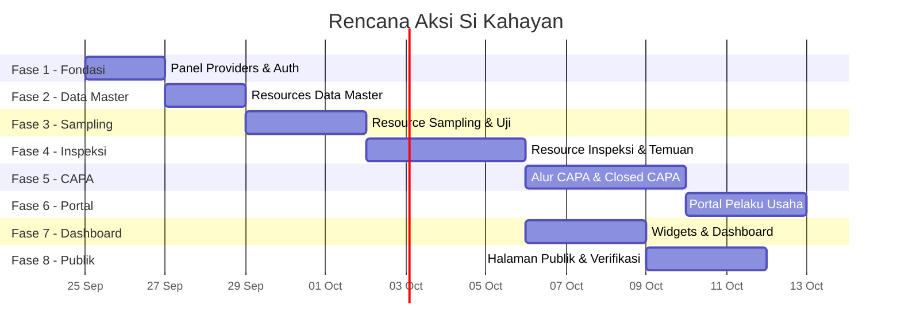

# 🗺️ Rencana Aksi — Si Kahayan Dashboard (Filament v5)

> **Proyek:** Sistem Informasi Kawal Hasil Pengawasan — BBPOM Palangka Raya
> **Stack:** Laravel 13 · Filament v5.8 · PostgreSQL · Livewire 4 · Tailwind CSS
> **Tanggal:** 25 September 2026

---

## Status Proyek Saat Ini

| Komponen | Status |
|----------|--------|
| Migrations (21 file) | ✅ Selesai |
| Models (18 file) | ✅ Selesai |
| Enums (13 file) | ✅ Selesai |
| Seeders (8 file) | ✅ Selesai & Dijalankan |
| Panel Providers | ✅ Selesai (`AdminPanelProvider`, `PimpinanPanelProvider`, `PortalPanelProvider`) |
| Policies & Authorization (8 Policy) | ✅ Selesai (Role-based access) |
| Filament Resources Data Master | ✅ Selesai (Users, Facilities, FoodCategories, FoodTypes, TestParameters, InspectionRequirements, SupervisionPlans) |
| Modul Sampling & Pengujian | ✅ Selesai (`SamplingResource`, `TestResultsRelationManager`, `AttachmentsRelationManager`, `StatusHistoriesRelationManager`, aksi publikasi) |
| Modul Inspeksi & Temuan | ✅ Selesai (`InspectionResource`, `InspectionFindingsRelationManager` dengan penutupan/pembukaan temuan, penerbitan BAP resmi & token QR, publikasi) |
| Alur Evaluasi CAPA & Closed CAPA | ✅ Selesai (`CapaSubmissionsRelationManager` review terima/tolak, `CapaClosureResource` alur verifikasi Ketua Tim & pengesahan Kepala Balai) |
| Dashboard Widget & Export Excel/PDF | ⏭️ Dilewati (Sesuai arahan pengguna) |
| Portal Pelaku Usaha | ⏭️ Dilewati (Sesuai arahan pengguna) |

---

## Ikhtisar Fase



---

## Fase 1 — Fondasi Panel & Otorisasi (±2 hari)

Menyiapkan 3 panel Filament, middleware autentikasi, dan sistem role-based access.

### 1.1 Panel Providers

| Panel | File Provider | Path | Peran yang Boleh Akses |
|-------|---------------|------|------------------------|
| Admin | `AdminPanelProvider.php` | `/admin` | `admin`, `inspector`, `team_leader` |
| Pimpinan | `PimpinanPanelProvider.php` | `/pimpinan` | `team_leader`, `head` |
| Portal | `PortalPanelProvider.php` | `/portal` | `business` |

**Langkah:**

- [ ] Buat `PimpinanPanelProvider` dan `PortalPanelProvider` via `php artisan make:filament-panel`
- [ ] Konfigurasi setiap panel: `->id()`, `->path()`, `->login()`, `->colors()`, `->brandName()`
- [ ] Set `->discoverResources()`, `->discoverPages()`, `->discoverWidgets()` ke namespace masing-masing panel:
  - Admin → `App\Filament\Resources`, `App\Filament\Pages`, `App\Filament\Widgets`
  - Pimpinan → `App\Filament\Pimpinan\Resources`, `App\Filament\Pimpinan\Pages`, `App\Filament\Pimpinan\Widgets`
  - Portal → `App\Filament\Portal\Resources`, `App\Filament\Portal\Pages`, `App\Filament\Portal\Widgets`
- [ ] Update `AdminPanelProvider` yang sudah ada: tambahkan konfigurasi `->brandName('Si Kahayan — Admin')`

### 1.2 Middleware & Akses Panel

- [ ] Buat middleware `CheckPanelAccess` atau gunakan fitur `->canAccess()` pada masing-masing panel provider berdasarkan `UserRole` enum
- [ ] Pastikan `User` model mengimplementasikan `FilamentUser` dan method `canAccessPanel(Panel $panel): bool`
- [ ] Konfigurasi redirect setelah login ke panel yang sesuai dengan role user

### 1.3 Policies

- [ ] Buat Policy class untuk setiap model utama:

| Policy | Model | Aturan Kunci |
|--------|-------|--------------|
| `SupervisionPlanPolicy` | `SupervisionPlan` | Hanya `team_leader` buat/edit |
| `SamplingPolicy` | `Sampling` | `inspector` & `team_leader` buat/edit, `team_leader` publikasi |
| `InspectionPolicy` | `Inspection` | `inspector` & `team_leader` buat/edit |
| `InspectionFindingPolicy` | `InspectionFinding` | `inspector` tutup temuan |
| `CapaSubmissionPolicy` | `CapaSubmission` | `business` kirim, `inspector` review |
| `CapaClosurePolicy` | `CapaClosure` | `team_leader` verifikasi, `head` sahkan |
| `FacilityPolicy` | `Facility` | `admin` kelola, `business` hanya lihat miliknya |
| `UserPolicy` | `User` | Hanya `admin` |

- [ ] Daftarkan semua Policy di `AuthServiceProvider`

---

## Fase 2 — Resources Data Master (±2 hari)

CRUD sederhana untuk tabel referensi yang menjadi fondasi data lainnya.

### 2.1 Admin Panel Resources

| Resource | Model | Fitur |
|----------|-------|-------|
| `UserResource` | `User` | Tabel, create, edit. Filter by role & status. Admin only |
| `FacilityResource` | `Facility` | Tabel, create, edit. Filter by type, regency, status. Kolom sensitif (NIB, NPWP) terenkripsi |
| `FoodCategoryResource` | `FoodCategory` | CRUD sederhana |
| `FoodTypeResource` | `FoodType` | CRUD dengan relasi ke `FoodCategory` (Select relationship) |
| `TestParameterResource` | `TestParameter` | CRUD sederhana, toggle `is_active` |
| `InspectionRequirementResource` | `InspectionRequirement` | CRUD, filter by `standard` (CPPOB/CPerPOB) |
| `SupervisionPlanResource` | `SupervisionPlan` | CRUD, filter by status/period. Hanya `team_leader` |

**Langkah per Resource:**

- [ ] Generate via `php artisan make:filament-resource {Model} --generate --no-interaction`
- [ ] Definisikan `form()` schema dengan field dan validasi sesuai migration
- [ ] Definisikan `table()` dengan kolom, filter, dan search
- [ ] Tambahkan `->policy()` atau daftarkan Policy otomatis via naming convention
- [ ] Jalankan Pint: `vendor/bin/pint --dirty --format agent`

---

## Fase 3 — Modul Sampling & Pengujian (±3 hari)

### 3.1 SamplingResource (Admin Panel)

**Form Schema:**

```
Section "Informasi Sampling"
├── Grid(2)
│   ├── TextInput sampling_number (auto-generate, readonly)
│   ├── Select plan_id → relationship SupervisionPlan
│   ├── Select inspector_id → relationship User (role=inspector)
│   ├── DatePicker sampling_date
│   ├── TextInput product_name
│   ├── TextInput brand
│   ├── Select food_type_id → relationship FoodType (grouped by FoodCategory)
│   ├── TextInput sampling_location
│   ├── Select sampling_facility_id → relationship Facility (opsional)
│   └── TextInput purchase_price (numeric, prefix "Rp")
│
Section "Geolokasi" (readonly, diisi otomatis)
├── TextInput geo_latitude (disabled)
├── TextInput geo_longitude (disabled)
├── TextInput geo_accuracy_m (disabled)
└── DateTimePicker geo_captured_at (disabled)
│
Section "Hasil Pengujian"
├── DatePicker test_date
├── Select status → SamplingStatus enum (live)
├── Select conclusion → SamplingConclusion enum (visible jika status=completed)
├── Textarea conclusion_notes (required jika conclusion=non_compliant)
└── Textarea recommendation (required jika conclusion=non_compliant)
```

**Langkah:**

- [ ] Generate `SamplingResource` dengan `--generate`
- [ ] Kustomisasi form schema sesuai di atas
- [ ] Tambahkan Relation Manager `TestResultsRelationManager` untuk mengelola hasil uji per parameter
- [ ] Buat Action **"Mulai Sampling"** yang merekam geolokasi via JavaScript → Livewire (Geolocation API browser)
- [ ] Buat Action **"Publikasikan"** untuk mengubah `publication_status` → `published` (hanya `team_leader`)
- [ ] Setiap perubahan status → insert ke `status_histories` (Model Observer atau Action class)
- [ ] Tambahkan Infolist untuk halaman View/detail

### 3.2 TestResultsRelationManager

- [ ] Kolom: `test_parameter_id` (Select), `result_value`, `unit`, `requirement_limit`, `compliance_status` (Select enum)
- [ ] Inline editing via Relation Manager table

### 3.3 Tabel & Filter Sampling

- [ ] Kolom tabel: `sampling_number`, `sampling_date`, `product_name`, `food_type.name`, `status` (Badge), `conclusion` (Badge warna), `publication_status`
- [ ] Filter: `status`, `conclusion`, `publication_status`, `food_type_id`, periode tanggal
- [ ] Search: `product_name`, `brand`, `sampling_number`
- [ ] Bulk action: Publikasi massal (team_leader)

---

## Fase 4 — Modul Inspeksi, Temuan & BAP (±4 hari)

### 4.1 InspectionResource (Admin Panel)

**Form Schema:**

```
Section "Informasi Inspeksi"
├── Grid(2)
│   ├── TextInput inspection_number (auto-generate, readonly)
│   ├── Select plan_id → relationship SupervisionPlan
│   ├── Select facility_id → relationship Facility (required)
│   ├── Select inspector_id → relationship User (role=inspector)
│   ├── DatePicker inspection_date
│   ├── Select status → InspectionStatus enum
│   ├── TextInput grade
│   └── Textarea conclusion
│
Section "Geolokasi" (readonly)
├── (sama seperti Sampling)
│
Section "Publikasi"
├── Select publication_status
```

**Langkah:**

- [ ] Generate `InspectionResource`
- [ ] Kustomisasi form schema
- [ ] Buat Action **"Mulai Pemeriksaan"** → rekam geotagging (koordinat tidak bisa diubah)
- [ ] Buat Action **"Publikasikan"** → `publication_status = published` (team_leader)

### 4.2 InspectionFindingsRelationManager

- [ ] Relation Manager di dalam `InspectionResource`
- [ ] Form: `requirement_id` (Select, opsional), `standard` (Select enum), `description`, `recommendation`, `due_date`, `status` (readonly, diubah via Action)
- [ ] Action **"Tutup Temuan"** → set `status = closed`, `closed_at`, `closed_by` (inspector)
- [ ] Action **"Buka Kembali"** → set `status = open` jika CAPA ditolak
- [ ] Badge warna untuk status: `open` = merah, `closed` = hijau
- [ ] Indikator **"Terlambat"** jika `due_date < now()` dan masih `open`

### 4.3 AttachmentsRelationManager (Polymorphic)

- [ ] Buat Relation Manager reusable untuk `Attachments` (dipakai di Inspection, Finding, CapaSubmission)
- [ ] Form: `FileUpload`, caption, otomatis isi `uploaded_by`, `mime`, `size_kb`

### 4.4 BAP Document — Generasi PDF & QR

**Dependensi baru (minta persetujuan user):**

- `barryvdh/laravel-dompdf` — generate PDF
- `simplesoftwareio/simple-qrcode` — generate QR Code

**Langkah:**

- [ ] Install paket setelah persetujuan user
- [ ] Buat Blade template BAP (layout resmi: header instansi, isi pemeriksaan, tanda tangan)
- [ ] Action **"Terbitkan BAP"** pada InspectionResource:
  1. Generate `qr_token` unik
  2. Simpan `content_snapshot` (JSONB berisi salinan data inspeksi + temuan)
  3. Generate PDF dengan QR Code yang mengarah ke `/verify/{qr_token}`
  4. Simpan file PDF
  5. Kirim email + notifikasi ke pelaku usaha
  6. Update `inspection.status → bap_issued`
- [ ] Buat `BapDocumentResource` (readonly) atau tampilkan sebagai Infolist di InspectionResource

### 4.5 Follow-Up Letters

- [ ] Action **"Kirim Surat Tindak Lanjut"** di InspectionResource
- [ ] Upload file surat, isi `sent_by`, `sent_to_email`, kirim email
- [ ] Hanya aktif jika inspeksi punya temuan `open`

---

## Fase 5 — Alur CAPA & Closed CAPA (±4 hari)

### 5.1 CapaSubmission — Portal Pelaku Usaha

- [ ] Buat `CapaSubmissionResource` di Portal panel (`App\Filament\Portal\Resources`)
- [ ] Pelaku usaha hanya melihat temuan untuk sarana miliknya (scoped via `facility_users`)
- [ ] Form: `finding_id` (otomatis dari konteks), `corrective_action`, `preventive_action`, file upload bukti
- [ ] `round` auto-increment per finding
- [ ] Status otomatis `submitted` saat kirim

### 5.2 CapaSubmission — Review di Admin

- [ ] Tampilkan CAPA submissions sebagai Relation Manager di `InspectionFindingResource` atau nested di `InspectionResource`
- [ ] Action **"Terima CAPA"** → `status = accepted`, set `reviewed_by`, `reviewed_at`, tutup temuan (`finding.status = closed`)
- [ ] Action **"Tolak CAPA"** → `status = rejected`, `review_notes` (wajib), buka kembali kesempatan CAPA baru
- [ ] Notifikasi ke pelaku usaha setiap perubahan status

### 5.3 CapaClosure — Alur Pengesahan Berurutan

| Tahap | Aktor | Action | Status Berikutnya |
|-------|-------|--------|-------------------|
| 1 | Sistem | Seluruh temuan `closed` → buat record | `pending_verification` |
| 2 | Ketua Tim | **"Verifikasi"** | `pending_approval` |
| 3 | Kepala Balai | **"Sahkan"** (+ konfirmasi password) | `approved` |
| 4 | Sistem | Generate PDF surat + kirim | `sent` |
| — | Ketua Tim | **"Kembalikan"** | `returned` → kembali ke review CAPA |

**Langkah:**

- [ ] Buat `CapaClosureResource` di Admin panel (untuk Ketua Tim)
- [ ] Buat halaman/Action di Pimpinan panel untuk pengesahan Kepala Balai
- [ ] Generate PDF surat Closed CAPA dengan tanda tangan digital Kepala Balai
- [ ] Kirim surat via email + notifikasi ke pelaku usaha
- [ ] Validasi: Closed CAPA tidak bisa dibuat jika masih ada temuan `open`
- [ ] Setiap perubahan status → `status_histories`

### 5.4 StatusHistories — Tampilan Riwayat

- [ ] Buat Relation Manager `StatusHistoriesRelationManager` (polymorphic, readonly)
- [ ] Tabel: `old_status`, `new_status`, `user.name`, `notes`, `created_at`
- [ ] Pasang di `SamplingResource`, `InspectionResource`, `CapaClosureResource`

---

## Fase 6 — Portal Pelaku Usaha (±3 hari)

### 6.1 Setup Portal Panel

- [ ] Konfigurasi `PortalPanelProvider`: branding, warna, login khusus pelaku usaha
- [ ] Scope global: semua query di portal di-filter berdasarkan `facility_users` milik user yang login

### 6.2 Resources Portal

| Resource | Fitur |
|----------|-------|
| `PortalInspectionResource` | List inspeksi sarana milik user, Infolist detail, lihat temuan & rekomendasi (readonly) |
| `PortalCapaSubmissionResource` | List CAPA yang sudah dikirim, buat CAPA baru untuk temuan `open`, lihat status review |
| `PortalDocumentResource` | List & download BAP dan surat Closed CAPA |

### 6.3 Dashboard Portal

- [ ] Widget ringkasan: jumlah inspeksi, temuan open, CAPA pending, Closed CAPA
- [ ] Widget notifikasi: BAP baru, hasil review CAPA

---

## Fase 7 — Dashboard & Widget (±3 hari)

### 7.1 Dashboard Admin

| Widget | Tipe | Data |
|--------|------|------|
| `SamplingStatsWidget` | `StatsOverviewWidget` | Total sampling, MS, TMS, dalam proses |
| `InspectionStatsWidget` | `StatsOverviewWidget` | Total inspeksi, temuan open, closed, terlambat |
| `CapaStatsWidget` | `StatsOverviewWidget` | CAPA submitted, accepted, rejected, Closed CAPA |
| `SamplingPerMonthChart` | `ChartWidget` (Bar) | Jumlah sampling per bulan, grouped by conclusion |
| `InspectionPerMonthChart` | `ChartWidget` (Bar) | Jumlah inspeksi per bulan |
| `FindingByCategoryChart` | `ChartWidget` (Doughnut) | Temuan per standar (CPPOB vs CPerPOB) |
| `CapaStatusChart` | `ChartWidget` (Pie) | Distribusi status CAPA |

### 7.2 Dashboard Pimpinan

| Widget | Tipe | Data |
|--------|------|------|
| Semua widget Admin | — | Inherited |
| `OverdueCapaWidget` | `TableWidget` | Daftar temuan yang melewati batas waktu |
| `AwaitingApprovalWidget` | `TableWidget` | CAPA Closure menunggu pengesahan Kepala Balai |
| `SupervisionMapWidget` | Custom Widget | Peta Leaflet + OpenStreetMap: sebaran inspeksi & sampling |
| `TrendAnalysisChart` | `ChartWidget` (Line) | Tren MS/TMS dan temuan per kuartal |

### 7.3 Peta Sebaran (Leaflet)

- [ ] Buat custom Livewire widget `SupervisionMapWidget`
- [ ] Tampilkan marker inspeksi dan sampling dengan clustering
- [ ] Popup info: nama sarana/produk, tanggal, status
- [ ] Filter by: kabupaten/kota, periode, jenis (sampling/inspeksi)
- [ ] **Polling** berkala untuk update data (sesuai PRD: "real-time" = polling)

### 7.4 Laporan & Ekspor

- [ ] Custom Page **"Laporan"** di panel Pimpinan
- [ ] Filter: periode (bulanan/triwulanan), kategori pangan, jenis sarana, kabupaten
- [ ] Ekspor format: **Excel** (via `maatwebsite/excel` atau Filament export) dan **PDF**
- [ ] Isi laporan: rekap sampling + pengujian, rekap inspeksi + temuan, status tindak lanjut CAPA

---

## Fase 8 — Halaman Publik (±3 hari)

### 8.1 Route & Controller Publik

Halaman publik bukan bagian dari panel Filament, melainkan route Laravel biasa dengan Blade/Livewire.

| Route | Fitur |
|-------|-------|
| `GET /` | Landing page + dashboard publik |
| `GET /sampling` | Daftar sampling & hasil uji yang sudah `published` |
| `GET /inspeksi` | Daftar inspeksi yang sudah `published` |
| `GET /peta` | Peta sebaran pengawasan (tingkat kabupaten/kota) |
| `GET /cari` | Pencarian produk & sarana (full-text search via `search_vector`) |
| `GET /verify/{token}` | Validasi BAP via QR Code token |

### 8.2 Aturan Whitelist Publik

Data yang ditampilkan ke publik **HANYA** kolom berikut (sesuai Lampiran B poin 4):

| Entitas | Kolom Publik |
|---------|-------------|
| Sampling | `sampling_date`, `product_name`, `food_type.name`, `food_category.name`, `sampling_location`, `conclusion`, `test_results` (parameter, value, compliance) |
| Inspeksi | `inspection_date`, `facility.name`, `facility.regency`, `facility.facility_type`, `grade`, `conclusion` |

**TIDAK** ditampilkan: NIB, NPWP, NIE, kontak, penanggung jawab, alamat lengkap, foto, CAPA, tanda tangan, koordinat GPS penuh.

### 8.3 Dashboard Publik

- [ ] Stat cards: total sampling, total inspeksi, jumlah MS/TMS, jumlah sarana diperiksa
- [ ] Chart: sampling per bulan, distribusi MS/TMS
- [ ] Peta: hanya tingkat kabupaten/kota (tanpa koordinat penuh)
- [ ] Pencarian full-text dengan `tsvector`

### 8.4 Halaman Verifikasi BAP

- [ ] Route `GET /verify/{token}`
- [ ] Cari `BapDocument` by `qr_token`
- [ ] Tampilkan info BAP (nomor, tanggal, nama sarana) jika valid
- [ ] Tampilkan "Dokumen tidak ditemukan" jika invalid

---

## Paket Tambahan yang Dibutuhkan

> [!IMPORTANT]
> Perlu persetujuan sebelum menginstal paket baru.

| Paket | Kegunaan | Perintah |
|-------|----------|---------|
| `barryvdh/laravel-dompdf` | Generate PDF (BAP, surat Closed CAPA, laporan) | `composer require barryvdh/laravel-dompdf` |
| `simplesoftwareio/simple-qrcode` | QR Code untuk BAP | `composer require simplesoftwareio/simple-qrcode` |
| `maatwebsite/excel` | Ekspor laporan ke Excel | `composer require maatwebsite/excel` |

---

## Hal-Hal Teknis Cross-Cutting

### Notifikasi

| Event | Channel | Penerima |
|-------|---------|----------|
| BAP terbit | Email + in-app | Pelaku usaha |
| Surat tindak lanjut dikirim | Email + in-app | Pelaku usaha |
| CAPA dikirim pelaku usaha | In-app | Inspector |
| CAPA diterima/ditolak | Email + in-app | Pelaku usaha |
| Closed CAPA terbit | Email + in-app | Pelaku usaha |

### Audit Log

- [ ] Implementasikan Model Observer atau Trait `Auditable` untuk mencatat perubahan data penting ke tabel `audit_logs`
- [ ] Catat: `event`, `auditable_type`, `auditable_id`, `old_values`, `new_values`, `ip_address`, `user_id`

### Geotagging

- [ ] Buat komponen Livewire/Alpine.js reusable untuk merekam koordinat via Geolocation API browser
- [ ] Dipanggil saat Action "Mulai Pemeriksaan" atau "Mulai Sampling"
- [ ] Koordinat disimpan di field `geo_*` dan **tidak bisa diedit** (tidak masuk `$fillable`, diisi server-side)

---

## Urutan Eksekusi yang Disarankan

```
Fase 1 (Fondasi)
    │
    ▼
Fase 2 (Data Master)
    │
    ▼
Fase 3 (Sampling) ──────────────────┐
    │                                │
    ▼                                ▼
Fase 4 (Inspeksi) ──► Fase 7 (Dashboard/Widget)
    │                                │
    ▼                                ▼
Fase 5 (CAPA) ──────► Fase 8 (Halaman Publik)
    │
    ▼
Fase 6 (Portal Pelaku Usaha)
```

> [!TIP]
> Fase 7 (Dashboard) dan Fase 8 (Publik) bisa dimulai begitu Fase 4 (Inspeksi) selesai, karena data sampling dan inspeksi sudah bisa ditampilkan. Fase 5 dan 6 bisa berjalan paralel dengan 7-8.

---

## Estimasi Waktu Total

| Fase | Estimasi |
|------|----------|
| 1 — Fondasi Panel & Auth | 2 hari |
| 2 — Data Master | 2 hari |
| 3 — Sampling & Pengujian | 3 hari |
| 4 — Inspeksi, Temuan & BAP | 4 hari |
| 5 — CAPA & Closed CAPA | 4 hari |
| 6 — Portal Pelaku Usaha | 3 hari |
| 7 — Dashboard & Widget | 3 hari |
| 8 — Halaman Publik | 3 hari |
| **Total** | **~24 hari kerja** |

> [!NOTE]
> Estimasi ini belum termasuk testing (unit/feature test), debugging, dan polish UI. Disarankan menambah buffer ±30% untuk testing dan perbaikan.
